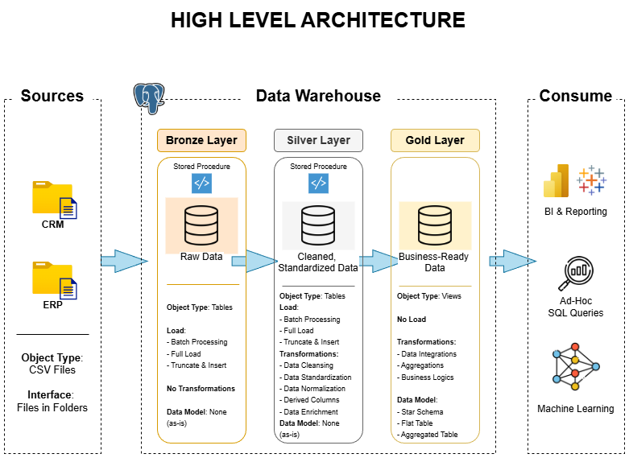
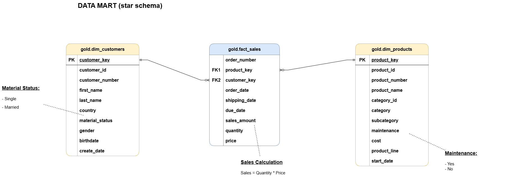

# 🏗️ SQL Data Warehouse Project

<div align="center">


**Construcción de un data warehouse moderno desde cero usando PostgreSQL y Arquitectura Medallion.**


[📖 Documentación](#documentación) · [🚀 Primeros Pasos](#primeros-pasos) · [🗂️ Estructura del Proyecto](#estructura-del-proyecto) · [🔄 Pipeline ETL](#pipeline-etl) · [📊 Modelo de Datos](#modelo-de-datos)

</div>

---

## 📋 Tabla de Contenidos

- [Sobre el Proyecto](#sobre-el-proyecto)
- [Visión General de la Arquitectura](#visión-general-de-la-arquitectura)
- [Estructura del Proyecto](#estructura-del-proyecto)
- [Fuentes de Datos](#fuentes-de-datos)
- [Pipeline ETL](#pipeline-etl)
- [Modelo de Datos](#modelo-de-datos)
- [Primeros Pasos](#primeros-pasos)
- [Ejecución de Scripts](#ejecución-de-scripts)
- [Tests y Calidad](#tests-y-calidad)
- [Documentación](#documentación)
- [Habilidades Demostradas](#habilidades-demostradas)
- [Licencia](#licencia)

---

## 🎯 Sobre el Proyecto

Este proyecto implementa un **data warehouse completo de estilo productivo** construido sobre PostgreSQL, siguiendo las mejores prácticas de la industria en ingeniería de datos y analítica. Consolida datos de sistemas fuente heterogéneos (ERP y CRM) en una capa unificada y lista para el análisis.

El proyecto cubre el **ciclo de vida completo de ingeniería de datos**:

- Ingesta de datos brutos desde archivos CSV
- Limpieza, transformación y estandarización de datos a través de múltiples capas
- Modelado de datos en un **Esquema en Estrella** optimizado para consultas analíticas
- Validación de la calidad de los datos en cada etapa del pipeline

Este repositorio está diseñado como un **proyecto de portafolio** para demostrar habilidades reales en arquitectura de datos, desarrollo ETL e ingeniería SQL.

---

## 🏛️ Visión General de la Arquitectura

El proyecto sigue la **Arquitectura Medallion**, un patrón de diseño de datos por capas que refina progresivamente los datos brutos en información lista para el negocio:

```
┌─────────────────────────────────────────────────────────────────┐
│                      FUENTES DE DATOS                           │
│           Sistema ERP (CSV)        Sistema CRM (CSV)            │
└─────────────────────┬───────────────────────┘
                      │ Ingesta
                      ▼
┌─────────────────────────────────────────────────────────────────┐
│  🥉 CAPA BRONZE  (Datos Brutos / Zona de Aterrizaje)            │
│  • Datos cargados tal cual desde los archivos CSV               │
│  • Sin transformaciones aplicadas                               │
│  • Preserva la integridad de los datos fuente                   │
└─────────────────────┬───────────────────────────────────────────┘
                      │ Limpiar y Estandarizar
                      ▼
┌─────────────────────────────────────────────────────────────────┐
│  🥈 CAPA SILVER  (Datos Limpios / Conformados)                  │
│  • Limpieza y deduplicación de datos                            │
│  • Estandarización de formatos y tipos de datos                 │
│  • Normalización entre sistemas fuente                          │
└─────────────────────┬───────────────────────────────────────────┘
                      │ Agregar y Modelar
                      ▼
┌─────────────────────────────────────────────────────────────────┐
│  🥇 CAPA GOLD  (Datos Listos para el Negocio / Analítica)       │
│  • Esquema en estrella: tablas de Hechos + Dimensiones          │
│  • Optimizado para reporting y herramientas BI                  │
│  • Claves sustitutas y lógica de negocio aplicadas              │
└─────────────────────────────────────────────────────────────────┘
```

| Capa | Propósito | Tablas | Operaciones Clave |
|------|-----------|--------|-------------------|
| **Bronze** | Ingesta bruta | Réplicas de fuentes | COPY desde CSV, sin transformaciones |
| **Silver** | Calidad de datos | Tablas limpias | Dedup, cast de tipos, manejo de NULLs, estandarizar |
| **Gold** | Analítica | Vistas de Hechos y Dims | Esquema estrella, claves sustitutas, agregaciones |

---

## 🗂️ Estructura del Proyecto

```
sql_data_warehouse_project/
│
├── 📁 datasets/                  # Archivos de datos fuente brutos
│   ├── erp_*.csv                 # Exportaciones del sistema ERP
│   └── crm_*.csv                 # Exportaciones del sistema CRM
│
├── 📁 docs/                      # Documentación y diagramas del proyecto
│   ├── data_architecture.png      # Diagrama general de arquitectura
│   ├── data_flow.png             # Flujo ETL desde la fuente hasta gold
│   ├── data_model.png            # Diagrama entidad-relación del esquema estrella
│   ├── integration_model.png     # Técnicas y métodos ETL
│   ├── data_catalog.md           # Descripciones de campos y metadatos por tabla
│   └── naming_conventions.md    # Estándares de nomenclatura para tablas, columnas y archivos
│
├── 📁 scripts/                   # Todos los scripts SQL (PL/pgSQL)
│   ├── 📁 bronze/                # Capa 1 – Carga de datos brutos
│   │   ├── ddl_bronze.sql
│   │   └── proc_load_bronze.sql
│   ├── 📁 silver/                # Capa 2 – Limpieza y transformación de datos
│   │   ├── ddl_silver.sql
│   │   └── proc_load_silver.sql
│   ├── 📁 gold/                  # Capa 3 – Modelos analíticos (Esquema Estrella)
│   │   └── ddl_gold.sql
│   │
│   └── init_database.sql
│
├── 📁 tests/                     # Scripts de calidad y validación de datos
│   ├── quality_checks_bronze.sql
│   ├── quality_checks_silver.sql
│   └── quality_checks_gold.sql
    └── v_quality_checks_gold.sql
│
├── LICENSE                       # Licencia MIT
└── README.md                     # Este archivo
```

---

## 📥 Fuentes de Datos

El warehouse consolida datos de dos sistemas fuente principales, ambos proporcionados como archivos CSV:

### 🏭 Sistema ERP
Datos operativos del sistema de planificación de recursos empresariales. Contiene información sobre:
- **Clientes** – datos demográficos e identificadores
- **Productos** – catálogo, categorías y precios
- **Pedidos de Venta** – datos transaccionales de ventas

### 🤝 Sistema CRM
Datos de gestión de relaciones con clientes. Contiene información sobre:
- **Interacciones con clientes** – datos de contacto y participación
- **Detalles de productos** – información complementaria de productos
- **Registros de ventas** – datos de rendimiento de ventas

> Ambos sistemas utilizan esquemas y convenciones de nomenclatura diferentes, que se reconcilian durante la transformación de la capa Silver.

---

## 🔄 Pipeline ETL

### 🥉 Capa Bronze — Ingesta Bruta

Los scripts en `scripts/bronze/` cargan datos CSV directamente en tablas PostgreSQL **sin ninguna transformación**.

```sql
-- Ejemplo: Cargar clientes ERP en bronze
COPY bronze.erp_customers
FROM '/ruta/a/datasets/erp_customers.csv'
DELIMITER ','
CSV HEADER;
```

**Qué ocurre aquí:**
- Las tablas replican la estructura de los archivos CSV fuente
- Todas las columnas se almacenan como `TEXT` o tipos nativos donde sea seguro
- Los timestamps registran cuándo se cargaron los datos
- No se aplican reglas de negocio

---

### 🥈 Capa Silver — Limpieza y Estandarización

Los scripts en `scripts/silver/` aplican transformaciones para preparar los datos para la analítica:

| Transformación | Descripción |
|----------------|-------------|
| **Conversión de tipos** | Convierte cadenas a tipos apropiados (`DATE`, `INT`, `NUMERIC`) |
| **Manejo de NULLs** | Reemplaza valores inválidos, rellena valores por defecto |
| **Deduplicación** | Elimina registros duplicados usando `ROW_NUMBER()` |
| **Estandarización** | Formatos de fecha unificados, códigos de categoría consistentes |
| **Normalización** | Alinea nombres de campos y valores entre ERP y CRM |
| **Limpieza de cadenas** | Elimina espacios en blanco y caracteres especiales |

```sql
-- Ejemplo: Limpiar datos de clientes en silver
INSERT INTO silver.customers
SELECT
    TRIM(customer_id)::INT                          AS customer_id,
    INITCAP(TRIM(first_name))                       AS first_name,
    INITCAP(TRIM(last_name))                        AS last_name,
    TO_DATE(birthdate, 'YYYY-MM-DD')                AS birthdate,
    CASE WHEN gender IN ('M','F') THEN gender
         ELSE 'N/A' END                             AS gender
FROM bronze.erp_customers
WHERE customer_id IS NOT NULL;
```

---

### 🥇 Capa Gold — Esquema Estrella y Analítica

Los scripts en `scripts/gold/` construyen el modelo analítico final usando **vistas** sobre las tablas Silver.


**Tablas de Dimensiones:**

| Tabla | Descripción | Campos Clave |
|-------|-------------|--------------|
| `dim_customers` | Perfil de clientes | `customer_key`, `customer_id`, `name`, `country`, `segment` |
| `dim_products` | Catálogo de productos | `product_key`, `product_id`, `category`, `subcategory`, `cost` |

**Tabla de Hechos:**

| Tabla | Descripción | Métricas Clave |
|-------|-------------|----------------|
| `fact_sales` | Transacciones de ventas | `sales_amount`, `quantity`, `unit_price`, `discount` |

Las **claves sustitutas** se generan con `ROW_NUMBER()` para desacoplar el warehouse de las claves de los sistemas fuente.

---

## 🚀 Primeros Pasos

### Requisitos Previos

Asegúrate de tener instalado lo siguiente:

- **PostgreSQL 13+** — [Descargar](https://www.postgresql.org/download/)
- **psql CLI** — incluido con PostgreSQL
- **pgAdmin 4** (opcional, interfaz gráfica recomendada) — [Descargar](https://www.pgadmin.org/)
- **Git** — [Descargar](https://git-scm.com/)

### Instalación

**1. Clonar el repositorio**

```bash
git clone https://github.com/aliciagilmatute/sql_data_warehouse_project.git
cd sql_data_warehouse_project
```

**2. Crear la base de datos**

```sql
-- Conéctate a PostgreSQL y ejecuta:
CREATE DATABASE data_warehouse;
```

O desde la terminal:

```bash
psql -U postgres -c "CREATE DATABASE data_warehouse;"
```

**3. Crear los esquemas**

```bash
psql -U postgres -d data_warehouse -c "
  CREATE SCHEMA IF NOT EXISTS bronze;
  CREATE SCHEMA IF NOT EXISTS silver;
  CREATE SCHEMA IF NOT EXISTS gold;
"
```

---

## ▶️ Ejecución de Scripts

Ejecuta las capas **en orden** — Bronze → Silver → Gold:

### Paso 1: Cargar la Capa Bronze

```bash
psql -U postgres -d data_warehouse -f scripts/bronze/create_bronze_tables.sql
psql -U postgres -d data_warehouse -f scripts/bronze/load_bronze.sql
```

### Paso 2: Transformar la Capa Silver

```bash
psql -U postgres -d data_warehouse -f scripts/silver/create_silver_tables.sql
psql -U postgres -d data_warehouse -f scripts/silver/load_silver.sql
```

### Paso 3: Construir la Capa Gold

```bash
psql -U postgres -d data_warehouse -f scripts/gold/create_gold_views.sql
```

### Paso 4: Ejecutar los Checks de Calidad

```bash
psql -U postgres -d data_warehouse -f tests/quality_checks_bronze.sql
psql -U postgres -d data_warehouse -f tests/quality_checks_silver.sql
psql -U postgres -d data_warehouse -f tests/quality_checks_gold.sql
```

> ⚠️ **Importante:** Actualiza las rutas de los archivos CSV en `load_bronze.sql` para que coincidan con la ruta absoluta en tu máquina local antes de ejecutar.

---

## ✅ Tests y Calidad

Los checks de calidad están definidos en `tests/` y validan la integridad de los datos en cada capa.

### Tipos de Checks

| Tipo de Check | Descripción | Capa |
|---------------|-------------|------|
| **Checks de NULL** | Verifica que los campos obligatorios no estén vacíos | Bronze, Silver, Gold |
| **Detección de duplicados** | Identifica claves primarias duplicadas | Silver, Gold |
| **Integridad referencial** | Valida las relaciones FK entre tablas | Gold |
| **Validación de rangos** | Comprueba que los valores numéricos están dentro de los límites esperados | Silver |
| **Unicidad** | Asegura que las claves sustitutas son únicas | Gold |
| **Conteo de filas** | Verifica que no hay pérdida de datos entre capas | Todas |

### Ejemplo de Check de Calidad

```sql
-- Comprobar IDs de cliente NULL en Silver
SELECT COUNT(*) AS ids_cliente_nulos
FROM silver.customers
WHERE customer_id IS NULL;
-- Resultado esperado: 0

-- Comprobar claves de producto duplicadas en Gold
SELECT product_key, COUNT(*) AS duplicados
FROM gold.dim_products
GROUP BY product_key
HAVING COUNT(*) > 1;
-- Resultado esperado: 0 filas
```

---

## 📖 Documentación

Toda la documentación del proyecto se encuentra en la carpeta `docs/`:

| Documento | Descripción |
|-----------|-------------|
| `data_architecture.png` | Diagrama de arquitectura de alto nivel del warehouse completo |
| `data_flow.png` | Flujo de datos desde los CSV fuente a través de cada capa hasta Gold |
| `data_model.png` | Diagrama ER del esquema estrella con relaciones entre tablas |
| `integration_model.png` | Técnicas, patrones y lógica de transformación ETL |
| `data_catalog.md` | Descripciones de cada tabla y columna del warehouse |
| `naming-conventions.md` | Estándares para nombrar tablas, columnas, esquemas y archivos |

> Abre los archivos `.drawio` con [draw.io Desktop](https://github.com/jgraph/drawio-desktop/releases) o en [app.diagrams.net](https://app.diagrams.net/).

---

## 💡 Habilidades Demostradas

Este proyecto muestra experiencia en varias disciplinas de ingeniería de datos:

**Arquitectura de Datos**
- Diseño de un warehouse multicapa usando Arquitectura Medallion
- Separación de responsabilidades entre las zonas Bronze, Silver y Gold

**Desarrollo ETL / ELT**
- Carga de datos CSV brutos en una base de datos relacional
- Escritura de transformaciones SQL complejas con CTEs, funciones de ventana y expresiones CASE
- Implementación de procedimientos almacenados para ejecución repetible del pipeline

**Modelado de Datos**
- Diseño de un Esquema en Estrella con tablas de hechos y dimensiones
- Generación de claves sustitutas con `ROW_NUMBER()`
- Integración de datos de múltiples fuentes heterogéneas

**Ingeniería de Calidad de Datos**
- Escritura de checks de calidad sistemáticos en cada etapa del pipeline
- Validación de NULLs, duplicados, integridad referencial y rangos de valores

**Documentación y Buenas Prácticas**
- Mantenimiento de un catálogo de datos con documentación a nivel de campo
- Aplicación de convenciones de nomenclatura consistentes
- Control de versiones con Git

---

## 🤝 Contribuciones

¡Las contribuciones, issues y solicitudes de funcionalidades son bienvenidas!

1. Haz un fork del repositorio
2. Crea tu rama de funcionalidad: `git checkout -b feature/nueva-funcionalidad`
3. Confirma tus cambios: `git commit -m 'Añadir nueva funcionalidad'`
4. Sube la rama: `git push origin feature/nueva-funcionalidad`
5. Abre un Pull Request

---

## 📄 Licencia

Este proyecto está licenciado bajo la **Licencia MIT** — consulta el archivo [LICENSE](LICENSE) para más detalles.

Eres libre de usar, modificar y distribuir este proyecto con la atribución correspondiente.

---

<div align="center">

Hecho con ❤️ por [Alicia Gil Matute](https://github.com/aliciagilmatute)

⭐ ¡Si este proyecto te ha sido útil, considera darle una estrella!

</div>
